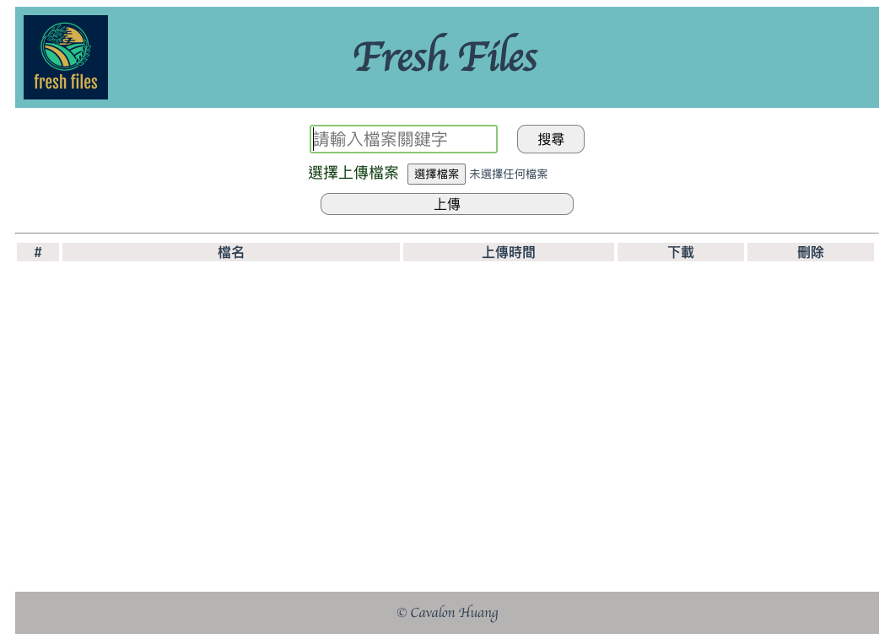
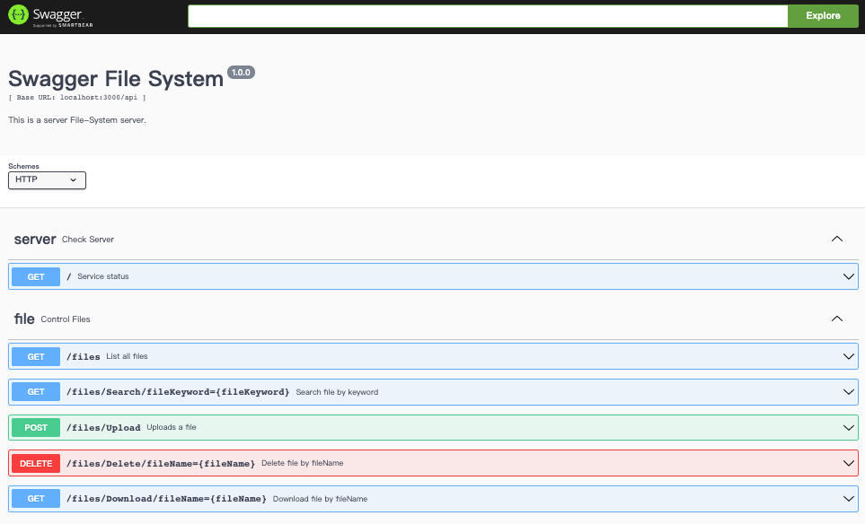

# file_system 檔案管理系統

## 功能：
搜尋、上傳、下載和刪除檔案。

## Server
Api功能：
- 列出所有檔案 -> host:port/api/files
- 關鍵字搜尋檔案 -> host:port/api/files/Search/fileKeyword=
- 上傳檔案 -> host:port/api/files/Upload
- 下載檔案 -> host:port/api/files/Download/fileName=
- 刪除檔案 -> host:port/api/files/Delete/fileName=

## Web
不提供列出所有檔案的功能，所以只串接4隻api。

## Swagger
展示所有api測試項目。

（以上為目前完成。)
---

## 預計加入的內容
- 使用vuex 整理api
- Jest 測試
- babel 打包